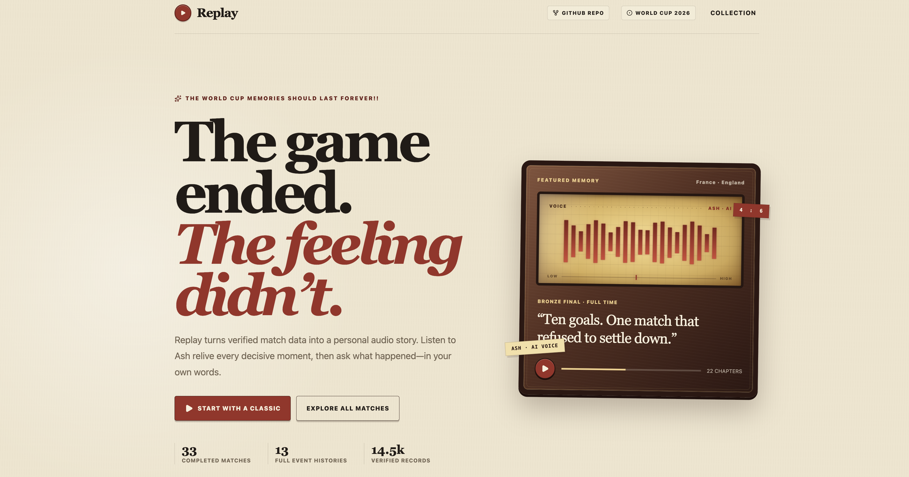
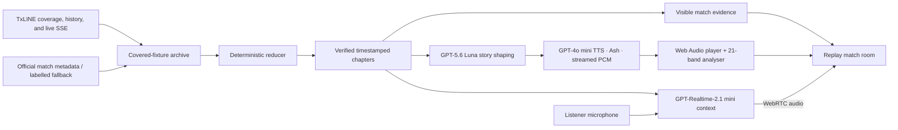

# **Replay: The World Cup memories should last forever.**

[](https://replay-txline.vercel.app/)
[](https://www.loom.com/share/712d3ae207cc46d98d53fb435c73b1f6)
[](https://txline.txodds.com/documentation/quickstart)
[](https://developers.openai.com/api/docs/guides/voice-agents)
[](https://nextjs.org/)

Replay is an audio-first World Cup memory player for fans who missed a match,
could not watch it, or simply want to feel it again. It turns verified match
records into timestamped chapters, expressive Ash narration, and an optional
voice-only conversation grounded in the selected game.

Its visual language recalls the warm radio sets and printed match programmes of
20th-century World Cups. Underneath that nostalgic surface is a modern stack:
TxLINE match data, a deterministic event reducer, OpenAI story and speech
models, WebRTC, Web Audio, Next.js, and a free Solana devnet subscription used
only to activate TxLINE access.



**Try the public, API-free edition:
[replay-txline.vercel.app](https://replay-txline.vercel.app/). It contains
pre-generated Ash audio for completed matches and makes no live OpenAI
requests.**

Video walkthrough:
[watch the Replay demo on Loom](https://www.loom.com/share/712d3ae207cc46d98d53fb435c73b1f6).

## What Replay Does

1. The fan chooses a match from TxLINE's published 2026 World Cup coverage.
2. Replay loads the ordered record and deterministically collapses duplicates,
   score changes, corners, cards, period boundaries, and pressure passages into
   timestamped chapters.
3. [GPT-5.6 Luna](https://developers.openai.com/api/docs/models/gpt-5.6-luna)
   shapes those verified chapters into a concise chronological story. It does
   not decide what happened.
4. The Speech API streams `gpt-4o-mini-tts` PCM in the **Ash** voice. The
   narration begins before the full response has arrived.
5. The Web Audio visualizer responds to real narration output. Playback speed
   changes continue from the current sample rather than restarting a chapter.
6. **Talk with Ash** opens an optional
   [`gpt-realtime-2.1-mini`](https://developers.openai.com/api/docs/models/gpt-realtime-2.1-mini)
   WebRTC conversation with the complete selected-match context.
7. Semantic voice activity detection handles turn-taking: tap once to start,
   speak naturally, interrupt naturally, and tap once to end.

Ash is always disclosed as an AI-generated voice. Scores, clocks, event facts,
and source receipts remain visible beside the narration.


## World Cup Archive

The checked-in archive follows TxLINE's published 2026 World Cup fixture scope:

- 34 named fixtures: two late group-stage matches, then every match from the
  Round of 32 through the final.
- 34 completed matches, including Spain's 1–0 extra-time win over Argentina in
  the final.
- 13 completed full TxLINE historical replays.
- 20 covered fixtures whose detailed TxLINE history is no longer retrievable,
  retained as clearly labelled official-event fallbacks.
- 14,459 locally archived source records.
- 480 pre-generated Ash MP3 chapters for the public demo.

Archived match browsing is available immediately after installation. Live
TxLINE refresh and streaming require the devnet setup described below.

## What This Repository Contains

| Path | Responsibility |
| --- | --- |
| `app/` | Next.js App Router pages plus server routes for archive, TxLINE, health, and OpenAI operations. |
| `components/` | The full Replay interface, radio-inspired match player, archive cards, and audio bar visualizer. |
| `hooks/` | Browser audio lifecycles: streamed PCM playback, speed-preserving rescheduling, WebRTC conversation, microphone and remote-output analysis. |
| `lib/ai/` | Ash performance direction, GPT-5.6 Luna story shaping, schemas, and grounded agent instructions. |
| `lib/game/` | Deterministic event engine and shared replay/game types. |
| `lib/replay/` | Archive loading, chapter reduction, demo-mode gates, and spoken-clock formatting. |
| `lib/txline/` | Server-only TxLINE snapshots, historical records, credential handling, and shared SSE fanout. |
| `data/knockout/` | The covered fixture catalog and locally archived, ordered match records. |
| `public/demo/replays/` | Cached public-demo manifests and 480 Ash MP3 chapters. |
| `scripts/data/` | Archive refresh and resumable public-demo audio generation. |
| `scripts/txline/` | Solana devnet subscription provisioning, the pinned TxODDS IDL, and authenticated feed verification. |
| `docs/` | Architecture, Solana setup, public-demo behavior, demo runbook, and README media. |
| `tests/` | Coverage-boundary, replay-receipt, offline-audio, event-engine, and spoken-clock tests. |
| `plans/` | Motion, reduced-motion, and interface implementation notes. |

## Architecture

Replay deliberately separates **truth**, **selection**, **story**,
**performance**, and **conversation**.



The browser never receives the long-lived OpenAI key, TxLINE API token, guest
JWT, Solana keypair, or wallet seed. Realtime receives only a short-lived client
secret minted by the Replay server.

### Two deployment modes

| Capability | Full local Replay | Public Vercel demo |
| --- | --- | --- |
| Story shaping | Live GPT-5.6 Luna | Pre-generated manifest |
| Narration | Streamed `gpt-4o-mini-tts` PCM with Ash | Cached Ash MP3 |
| Realtime conversation | `gpt-realtime-2.1-mini` over WebRTC | Explicitly disabled |
| Match source | Local archive plus authenticated TxLINE | Checked-in archive |
| Credentials | Server-side local secrets | None |

The Vercel edition is a build profile of the same source, not a second
application. `NEXT_PUBLIC_REPLAY_DEMO=1` selects cached client behavior, while
`VERCEL=1` or `REPLAY_DEMO_MODE=1` makes every OpenAI route fail closed with
HTTP `403` before credentials are read.

For a deeper technical walkthrough, read
[`docs/architecture.md`](docs/architecture.md).

## Models, APIs, and Libraries

### OpenAI

| Model or API | Use in Replay | Reference |
| --- | --- | --- |
| `gpt-5.6-luna` | Shapes deterministic match chapters into a structured replay story and interprets supported structured inputs. | [Model](https://developers.openai.com/api/docs/models/gpt-5.6-luna) · [Structured Outputs](https://developers.openai.com/api/docs/guides/structured-outputs) |
| `gpt-4o-mini-tts` + Ash | Performs chapter narration through the `/v1/audio/speech` endpoint as streamed 24 kHz, signed 16-bit PCM. | [Model](https://developers.openai.com/api/docs/models/gpt-4o-mini-tts) · [Text to speech](https://developers.openai.com/api/docs/guides/text-to-speech) |
| `gpt-realtime-2.1-mini` | Runs the optional, voice-in/voice-out, match-grounded Ash conversation. | [Model](https://developers.openai.com/api/docs/models/gpt-realtime-2.1-mini) · [WebRTC](https://developers.openai.com/api/docs/guides/realtime-webrtc) · [Voice agents](https://developers.openai.com/api/docs/guides/voice-agents) |
| `gpt-4o-mini-transcribe` | Supplies live English input transcription inside the Realtime session. | [Model](https://developers.openai.com/api/docs/models/gpt-4o-mini-transcribe) |
| `gpt-image-2` | Powers the optional server-side editorial poster route retained in the project. | [Model](https://developers.openai.com/api/docs/models/gpt-image-2) · [Image generation](https://developers.openai.com/api/docs/guides/image-generation) |
| OpenAI Agents SDK for JavaScript | Manages the browser Realtime session and WebRTC lifecycle. | [SDK repository](https://github.com/openai/openai-agents-js) |

### Sports data and Solana

| Service | Use in Replay | Reference |
| --- | --- | --- |
| TxLINE | Defines the covered fixture set and supplies authenticated historical scores plus live score/odds streams. | [Quickstart](https://txline.txodds.com/documentation/quickstart) · [World Cup free tier](https://txline.txodds.com/documentation/worldcup) · [Scores](https://txline.txodds.com/documentation/scores/overview) · [Snapshots](https://txline.txodds.com/documentation/examples/fetching-snapshots) · [Streaming](https://txline.txodds.com/documentation/examples/streaming-data) |
| Solana devnet | Activates the free TxLINE subscription. It is infrastructure only—there are no tokens, deposits, wagers, NFTs, or consumer wallet interactions in Replay. | [Install](https://solana.com/docs/intro/installation) · [CLI basics](https://solana.com/docs/intro/installation/solana-cli-basics) · [Devnet faucet](https://faucet.solana.com/) |
| Next.js 16 + React 19 | Hosts the interface, route handlers, static archive, demo build profile, and server-only trust boundary. | [Next.js docs](https://nextjs.org/docs) · [React docs](https://react.dev/) |

The exact JavaScript dependency versions are pinned in
[`package.json`](package.json) and [`pnpm-lock.yaml`](pnpm-lock.yaml).

## Server API

| Route | Purpose |
| --- | --- |
| `GET /api/archive/matches` | Returns the TxLINE-covered 2026 World Cup collection. |
| `GET /api/archive/matches/:fixtureId` | Returns compact, deduplicated replay chapters and evidence. |
| `GET /api/txline/fixtures` | Fetches authenticated fixture data from TxLINE. |
| `GET /api/txline/replay/:fixtureId` | Normalizes an authenticated TxLINE historical sequence. |
| `GET /api/txline/stream/scores` | Fans out a shared, reconnecting TxLINE scores SSE connection. |
| `GET /api/txline/stream/odds` | Fans out a shared, reconnecting TxLINE odds SSE connection. |
| `POST /api/openai/commentary` | Creates the structured GPT-5.6 Luna replay story. |
| `POST /api/openai/speech` | Streams Ash narration from the OpenAI Speech API. |
| `POST /api/openai/realtime-token` | Mints a short-lived, match-grounded Realtime client secret. |
| `POST /api/openai/poster` | Generates an optional editorial memory poster with GPT Image 2. |
| `GET /api/health` | Reports mode, OpenAI configuration, and TxLINE connection state without exposing secrets. |

## Local Setup

### 1. Prerequisites

- [Node.js 22 or newer](https://nodejs.org/en/download/archive/v22)
- [pnpm](https://pnpm.io/installation) through Corepack or a global install
- [Solana CLI](https://solana.com/docs/intro/installation) for TxLINE devnet
  provisioning
- An OpenAI API key with access to the models listed above
- A modern browser with Web Audio, WebRTC, and microphone access
- macOS, Linux, or Windows through WSL for the documented shell commands

`requirements.txt` is included for tooling that expects that filename, but
Replay has no Python runtime. The installable application libraries live in
`package.json` and are installed by pnpm.

### 2. Clone Replay

```bash
git clone https://github.com/Alfaxad/Replay.git
cd Replay
```

### 3. Install JavaScript dependencies

```bash
corepack enable
pnpm install --frozen-lockfile
```

### 4. Configure the OpenAI API key

Create a local environment file from the safe template:

```bash
cp .env.example .env.local
```

Edit `.env.local` and set one of the supported server-side variable names:

```dotenv
OPENAI_API_KEY="your-openai-api-key"
TXLINE_API_ORIGIN="https://txline-dev.txodds.com"
```

`OPEN_AI_KEY` is also accepted for compatibility. Never prefix the key with
`NEXT_PUBLIC_`, place it in client code, commit `.env.local`, or deploy it to the
public demo.

### 5. Create the project-local Solana devnet wallet

Replay keeps its disposable development wallet inside the ignored `.solana/`
directory instead of modifying your global Solana configuration.

```bash
mkdir -p .solana
solana-keygen new --outfile .solana/devnet-wallet.json
solana config set \
  --url devnet \
  --keypair .solana/devnet-wallet.json \
  --config .solana/config.yml
solana address --config .solana/config.yml
```

Save the generated recovery phrase somewhere appropriate for your environment.
The JSON keypair and phrase are secret material even though devnet SOL has no
monetary value.

Fund the wallet with test-only devnet SOL:

```bash
solana airdrop 1 --config .solana/config.yml
solana balance --config .solana/config.yml
```

If the CLI faucet is rate-limited, paste the public address from `solana
address` into the [official Solana faucet](https://faucet.solana.com/).

### 6. Provision and verify TxLINE

The provisioning script verifies that TxLINE service level `1` is free before
submitting the four-week devnet subscription. It refuses to continue if the
selected tier reports a non-zero TxL price.

```bash
pnpm txline:provision
pnpm txline:verify
```

Successful provisioning writes the activated API token and guest JWT to
`.solana/txline-devnet.json` with owner-only file permissions. The complete
`.solana/` directory is ignored by Git.

If you already have TxLINE credentials and do not want to use the local state
file, set these server-only values in `.env.local`:

```dotenv
TXLINE_API_TOKEN="your-txline-api-token"
TXLINE_GUEST_JWT="your-txline-guest-jwt"
TXLINE_API_ORIGIN="https://txline-dev.txodds.com"
```

Read [`docs/solana-devnet.md`](docs/solana-devnet.md) and
[`scripts/txline/README.md`](scripts/txline/README.md) for the subscription and
verification details.

### 7. Start the local server

```bash
pnpm dev
```

Open [http://127.0.0.1:3000](http://127.0.0.1:3000). The first time you select
**Talk with Ash**, the browser will request microphone permission.

For a production-style local run:

```bash
pnpm build
pnpm start
```

### 8. Confirm the installation

```bash
curl http://127.0.0.1:3000/api/health
pnpm lint
pnpm test
```

A fully configured local health response reports `"mode":"full"` and
`"openai":"configured"`. TxLINE live channels connect on demand when a stream
has subscribers.

## Useful Commands

| Command | Purpose |
| --- | --- |
| `pnpm dev` | Start the full local development server. |
| `pnpm build` | Build the full local production edition. |
| `pnpm start` | Start the production build on port 3000. |
| `pnpm lint` | Run the strict TypeScript check. |
| `pnpm test` | Run deterministic archive and event-engine tests. |
| `pnpm txline:provision` | Activate the free TxLINE Solana devnet subscription. |
| `pnpm txline:verify` | Verify snapshots, history, and score/odds streams. |
| `pnpm data:archive` | Refresh metadata and available match histories. |
| `pnpm demo:audio:plan` | Report the completed-match audio cache scope. |
| `pnpm demo:audio` | Resumably generate story manifests and Ash MP3 assets. |
| `pnpm build:vercel-demo` | Build the fail-closed, cached public edition. |

## Grounding, Privacy, and Failure Behavior

- TxLINE data and deterministic reducers establish match truth; models never
  invent or settle events.
- Every spoken event retains its verified minute and visible evidence.
- Pressure passages are labelled product-derived summaries of confirmed records.
- OpenAI, TxLINE, and wallet credentials remain server-side and are gitignored.
- Microphone access begins only after **Talk with Ash** and stops when the
  listener ends the conversation or leaves the replay room.
- If TTS is unavailable, the full chapter timeline and evidence remain usable.
- If Realtime or microphone access is unavailable, chapter narration remains
  usable.
- If live TxLINE is unavailable, the checked-in completed-match archive remains
  usable.
- The public Vercel deployment contains no OpenAI, TxLINE, or Solana secrets and
  performs no runtime AI calls.

## Commercial & Monetization Path

The commercialization and monetization of Replay is attainable through
subscription models that allow users to interact with agents and relive their
World Cup experiences through realtime conversations. Furthermore, the project
can expand to provide real-time experiences and personalized streaming during
the next World Cup, alongside pay-to-win multiplayer quizzes and timeback
replays of classic World Cup competitions.

## Links

- [Public Replay demo](https://replay-txline.vercel.app/)
- [Loom video walkthrough](https://www.loom.com/share/712d3ae207cc46d98d53fb435c73b1f6)
- [TxLINE quickstart](https://txline.txodds.com/documentation/quickstart)
- [TxLINE World Cup free tier](https://txline.txodds.com/documentation/worldcup)
- [OpenAI voice-agent guide](https://developers.openai.com/api/docs/guides/voice-agents)
- [OpenAI Realtime WebRTC guide](https://developers.openai.com/api/docs/guides/realtime-webrtc)
- [OpenAI text-to-speech guide](https://developers.openai.com/api/docs/guides/text-to-speech)
- [Solana CLI basics](https://solana.com/docs/intro/installation/solana-cli-basics)
